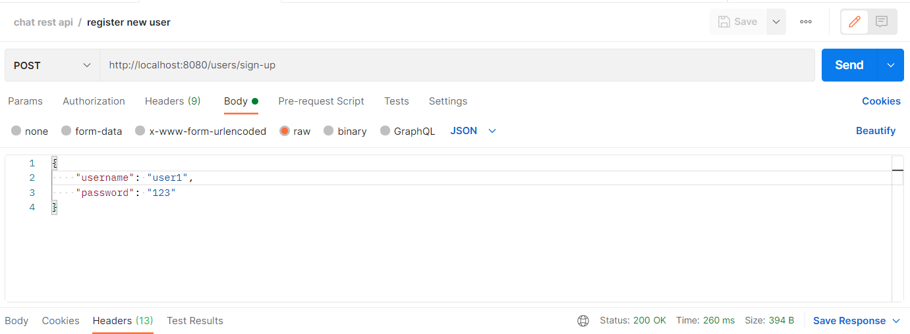
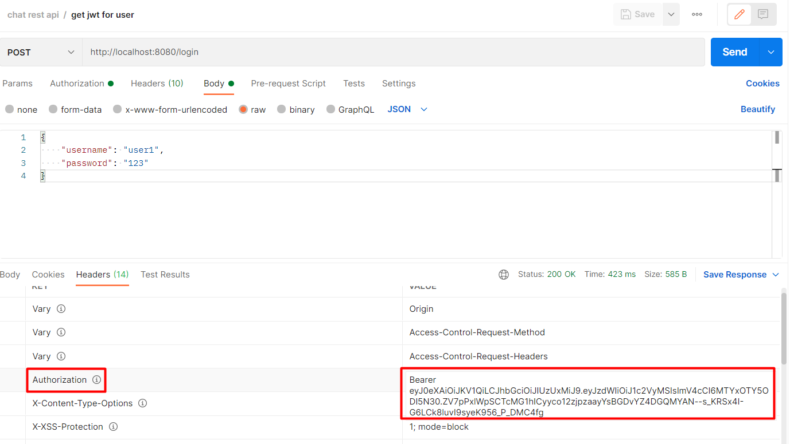
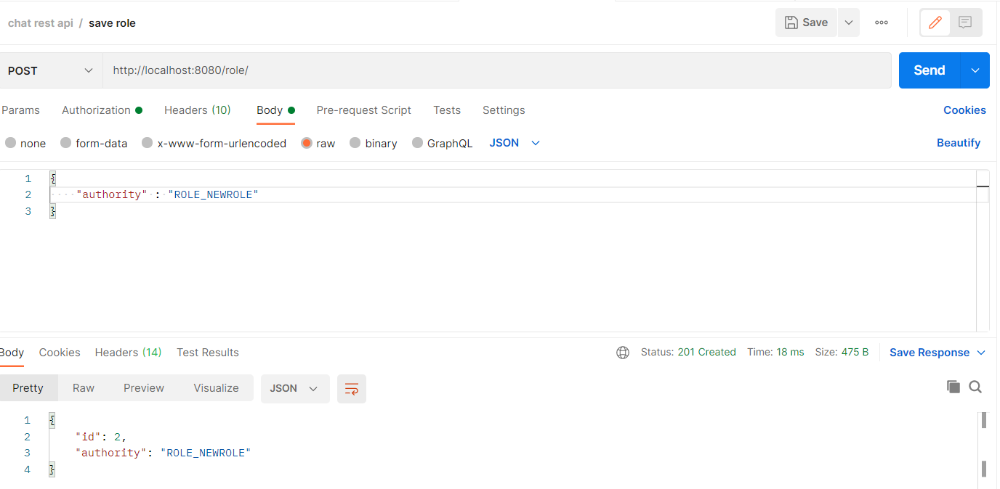
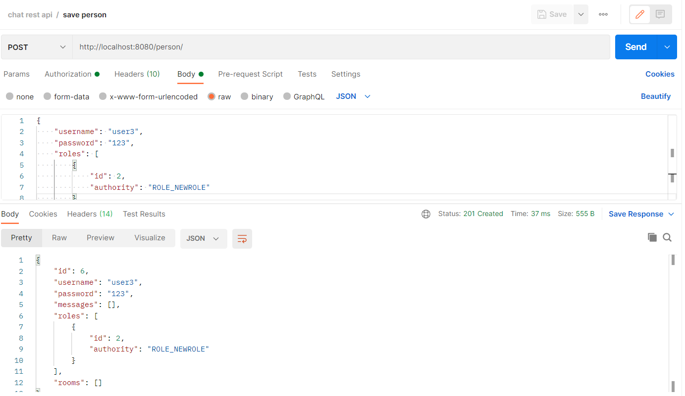
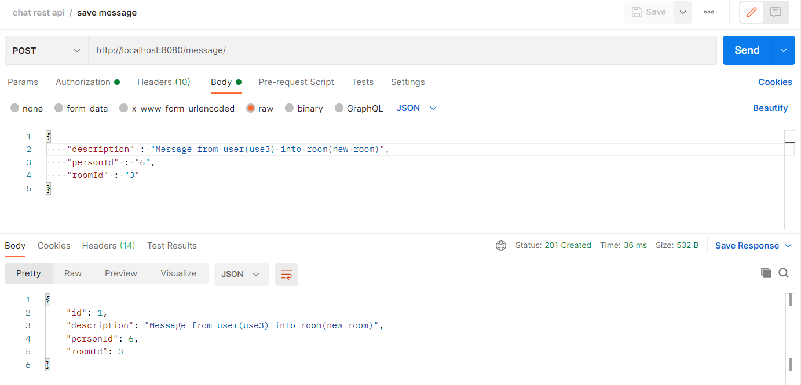
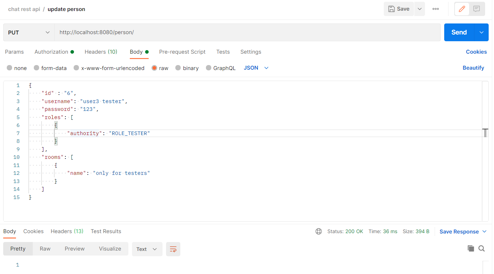
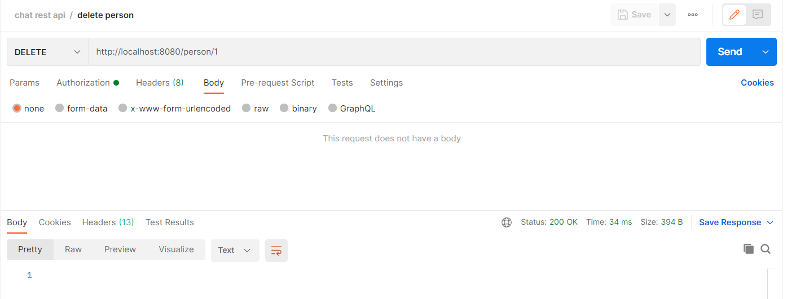
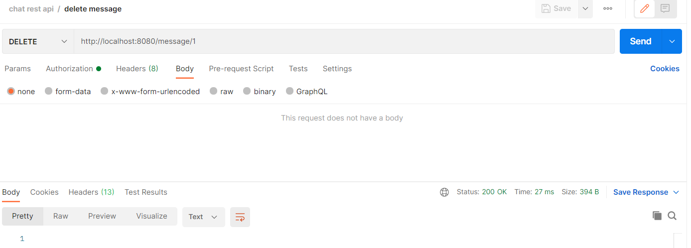

[](https://www.travis-ci.com/RomanRusanov/chat_rest_api)
[](https://www.codacy.com/gh/RomanRusanov/chat_rest_api/dashboard?utm_source=github.com&amp;utm_medium=referral&amp;utm_content=RomanRusanov/chat_rest_api&amp;utm_campaign=Badge_Grade)

# чат на REST Api через Spring Boot
Модели Person, Role, Room, Message.
Приложение реализовывает чат c комнатами.

### 1. Регистрация пользователя

http://localhost:8080/users/sign-up



### 2. Аутентификация пользователя получение jwt token

http://localhost:8080/login



### 3. Добавление новой роли

http://localhost:8080/role/



### 4. Добавление нового пользователя

http://localhost:8080/person/



### 5. Добавление новой комнаты

http://localhost:8080/room/


### 6. Добавление сообщения

http://localhost:8080/message/



### 7. Обновление данных пользователя

http://localhost:8080/person/



Response json
```
{
    "id": 6,
    "username": "user3 tester",
    "password": "123",
    "messages": [
        {
        "id": 1,
        "description": "Message from user(use3) into room(new room)",
        "personId": 6,
        "roomId": 3
        }
    ],
    "roles": [
        {
            "id": 2,
            "authority": "ROLE_NEWROLE"
        },
        {
            "id": 3,
            "authority": "ROLE_TESTER"
        }
    ],
    "rooms": [
        {
            "id": 8,
            "name": "only for testers",
            "messages": []
        }
    ]
}
```

### 8. Удаление пользователя и всех сообщений которые создал

http://localhost:8080/person/{id}



### 9. Удаление сообщения

http://localhost:8080/message/{id}



### 10. Удаление роли

http://localhost:8080/role/{id}

